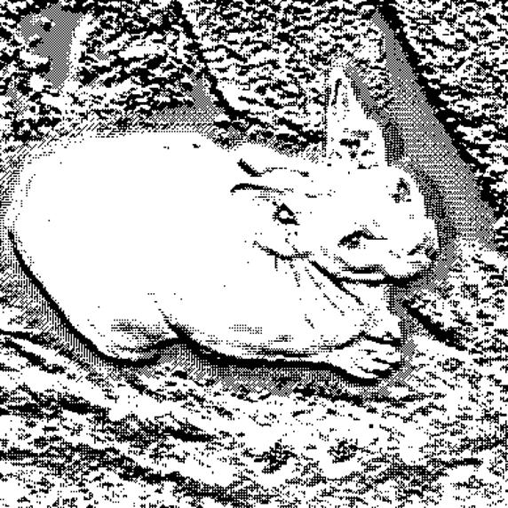
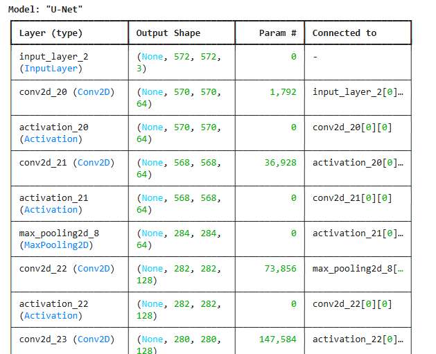

# U-Net: Deep Learning Image Segmentation

A TensorFlow/Keras implementation of the U-Net architecture for semantic image segmentation. This project demonstrates a complete U-Net model capable of performing pixel-level classification on images.


## Results

### Input Image


### Predicted Segmentation Mask


The model successfully generates pixel-level segmentation masks, identifying and classifying different regions in the input image.

## Table of Contents

- [Overview](#overview)
- [Architecture](#architecture)
  - [Encoder Block](#encoder-block)
  - [Bottleneck](#bottleneck)
  - [Decoder Block](#decoder-block)
  - [Skip Connections](#skip-connections)
- [Model Summary](#model-summary)
- [Installation](#installation)
- [Usage](#usage)
- [Project Structure](#project-structure)

##  Overview

U-Net is a convolutional neural network architecture originally designed for biomedical image segmentation. It features a symmetric U-shaped architecture with an encoder-decoder structure connected by skip connections, enabling precise localization and segmentation of objects in images.

**Key Features:**
-  Symmetric encoder-decoder architecture
-  Skip connections for preserving spatial information
-  Multi-scale feature extraction
-  Pixel-level segmentation output

##  Architecture

The U-Net architecture consists of three main components:

### Encoder Block

The encoder (contracting path) extracts hierarchical features from the input image through a series of convolutional and pooling operations.

```python
def encoder_block(inputs, num_filters):
    x = tf.keras.layers.Conv2D(num_filters, 3, padding='valid')(inputs)
    x = tf.keras.layers.Activation('relu')(x)
    
    x = tf.keras.layers.Conv2D(num_filters, 3, padding='valid')(x)
    x = tf.keras.layers.Activation('relu')(x)
    
    x = tf.keras.layers.MaxPool2D(pool_size=(2, 2), strides=2)(x)
    
    return x
```

**Functionality:**
- **Two 3×3 Convolutions**: Extract features at the current resolution
- **ReLU Activation**: Introduces non-linearity
- **Max Pooling**: Reduces spatial dimensions by half, increases receptive field
- **Progressive Filter Increase**: 64 → 128 → 256 → 512 filters across encoder blocks

**Purpose**: The encoder progressively reduces spatial dimensions while increasing feature depth, capturing high-level semantic information.

### Bottleneck

The bottleneck is the deepest part of the network, located between the encoder and decoder paths.

```python
# Bottleneck
b1 = tf.keras.layers.Conv2D(1024, 3, padding='valid')(e4)
b1 = tf.keras.layers.Activation('relu')(b1)
b1 = tf.keras.layers.Conv2D(1024, 3, padding='valid')(b1)
b1 = tf.keras.layers.Activation('relu')(b1)
```

**Functionality:**
- **Highest Feature Depth**: 1024 filters (double the last encoder block)
- **Two Convolutional Layers**: Further feature extraction at the lowest resolution
- **No Pooling**: Maintains the smallest spatial dimensions

**Purpose**: The bottleneck captures the most abstract, high-level features of the entire image, serving as the bridge between encoding and decoding.

### Decoder Block

The decoder (expansive path) reconstructs the spatial resolution while refining segmentation features.

```python
def decoder_block(inputs, skip_features, num_filters):
    x = tf.keras.layers.Conv2DTranspose(num_filters, (2, 2), strides=2, padding='valid')(inputs)
    
    skip_features = tf.keras.layers.Resizing(x.shape[1], x.shape[2])(skip_features)
    
    x = tf.keras.layers.Concatenate()([x, skip_features])
    
    x = tf.keras.layers.Conv2D(num_filters, 3, padding='valid')(x)
    x = tf.keras.layers.Activation('relu')(x)
    x = tf.keras.layers.Conv2D(num_filters, 3, padding='valid')(x)
    x = tf.keras.layers.Activation('relu')(x)
    
    return x
```

**Functionality:**
- **Transposed Convolution**: Upsamples feature maps by 2×, restoring spatial dimensions
- **Skip Connection Concatenation**: Merges upsampled features with encoder features
- **Two 3×3 Convolutions**: Refines combined features
- **Progressive Filter Decrease**: 512 → 256 → 128 → 64 filters across decoder blocks

**Purpose**: The decoder progressively increases spatial resolution while decreasing feature depth, combining high-level semantic information with fine-grained spatial details from skip connections.

### Skip Connections

**Skip connections** are the defining feature of U-Net architecture. They create direct pathways from encoder layers to corresponding decoder layers.

```
Encoder Layer → [Skip Connection] → Decoder Layer
     ↓                                    ↑
  Features                            Concatenated
```

**How They Work:**
1. **Feature Preservation**: Encoder features are saved before max pooling
2. **Spatial Alignment**: Encoder features are resized to match decoder dimensions
3. **Concatenation**: Encoder and decoder features are concatenated channel-wise
4. **Information Fusion**: Combines high-resolution spatial details (encoder) with semantic information (decoder)

**Benefits:**
-  **Preserves Spatial Information**: Fine-grained details aren't lost during downsampling
-  **Improves Localization**: Better boundary detection and object localization
-  **Faster Convergence**: Gradient flow is improved through direct connections
-  **Multi-Scale Features**: Combines features from different resolution levels

##  Model Summary

The complete U-Net model architecture:

- **Input Shape**: (572, 572, 3) - RGB images
- **Output Shape**: Segmentation mask with pixel-level predictions
- **Total Parameters**: ~31 million trainable parameters
- **Architecture**: Symmetric U-shape with 4 encoder/decoder blocks



## Installation

### Prerequisites

- Python 3.7+
- TensorFlow 2.x
- NumPy
- Pillow (PIL)

### Setup

```bash
# Clone the repository
git clone https://github.com/iSaahilx/U_Net_model.git
cd unet

# Install dependencies
pip install tensorflow numpy pillow
```

##  Usage

### Basic Usage

```python
from u_net import unet_model
import numpy as np
from PIL import Image
from tensorflow.keras.preprocessing import image

# Load and preprocess image
img = Image.open('cat.png').convert('RGB')
img = img.resize((572, 572))
img_array = image.img_to_array(img) / 255.0
img_array = np.expand_dims(img_array, axis=0)

# Create model
model = unet_model(input_shape=(572, 572, 3), num_classes=2)

# Make prediction
predictions = model.predict(img_array)

# Process output
pred_mask = np.squeeze(predictions, axis=0)
pred_mask = np.argmax(pred_mask, axis=-1).astype(np.uint8) * 255
pred_mask_img = Image.fromarray(pred_mask)

# Save result
pred_mask_img.save('predicted_image.jpg')
```

### Model Configuration

```python
# Custom input shape and number of classes
model = unet_model(
    input_shape=(256, 256, 3),  # (height, width, channels)
    num_classes=2                # Number of segmentation classes
)

# View model architecture
model.summary()
```

##  Project Structure

```
unet/
│
├── u_net.py                 # Main U-Net implementation
├── u_net.ipynb             # Jupyter notebook version
├── cat.png                 # Input test image
├── predicted_image.jpg     # Segmentation output
├── model_summary.png       # Model architecture visualization
└── README.md              # This file
```

## Model Components Summary

| Component | Purpose | Key Operations |
|-----------|---------|----------------|
| **Encoder Block** | Feature extraction & downsampling | Conv2D → ReLU → Conv2D → ReLU → MaxPool |
| **Bottleneck** | Deepest feature representation | Conv2D(1024) → ReLU → Conv2D(1024) → ReLU |
| **Decoder Block** | Upsampling & feature refinement | Conv2DTranspose → Concatenate(skip) → Conv2D → ReLU → Conv2D → ReLU |
| **Skip Connections** | Preserve spatial details | Direct encoder-to-decoder feature fusion |

##  References

- [U-Net: Convolutional Networks for Biomedical Image Segmentation](https://arxiv.org/abs/1505.04597) - Original U-Net paper by Ronneberger et al.

##  License

This project is open source and available under the MIT License.

##  Author

Created for deep learning and computer vision applications.

---

**Note**: This is an untrained model. For meaningful segmentation results, the model needs to be trained on a labeled dataset with appropriate loss functions (e.g., Dice Loss, Binary Cross-Entropy) and optimization strategies.

